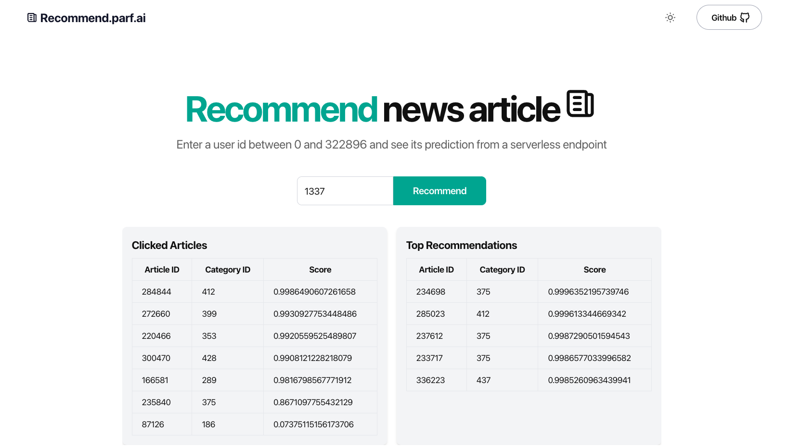

# Recommend.parf.ai

## INTRODUCTION

This project is a demo featuring a news recommendation models

- **PROD**: https://recommend.parf.ai/
- **DEV**: https://dev.recommend.parf.ai/

## FOLDER STRUCTURE

- [`.github`](.github/) code related to the [deployment](#website-deployment) of the website after a git push
- [`ai`](ai/) Code related to the model's development
- [`api`](api/) Code the inference API
- [`infrastructure`](infrastructure/) Code related the automated infrastructure
- [`website`](website/) Code related to the web app

### WEBSITE DEPLOYMENT

- Deploy the website after a git push **IF** the commit message contains the text: "deploy:website" within the commit message

    - branch dev to deploy to dev.recommend.parf.ai
    - branch prod to deploy to recommend.parf.ai